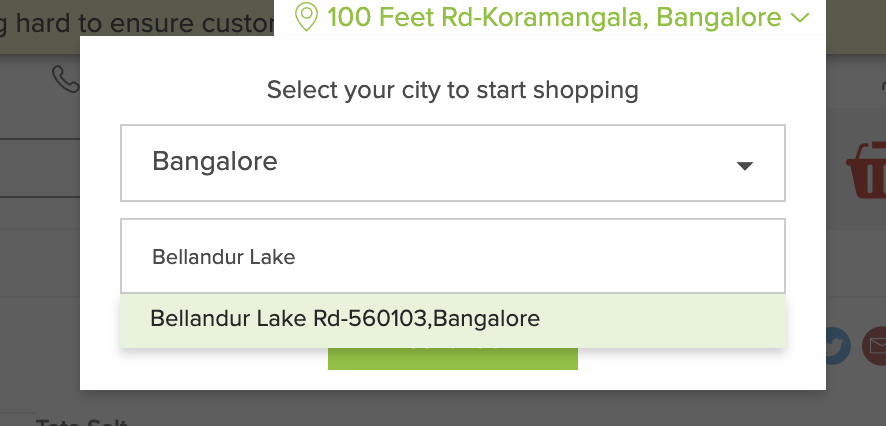

# Deployment

Currently, I am running this is AWS EC2 instance (free tier).

The steps are outlined in the `README.md`.

You need to have these env vars present in your env before doing make build.
```bash
FROM_ADDR=...
EMAIL_PASSWORD=...
URL=https://www.bigbasket.com/pd/241600/tata-salt--iodized-1-kg-pouch/
```
These are the email id and the password for the account used by the service to send delivery alerts.
I use the above `URL` to check whether there are slots (since I think salt is super important :P).
So you can keep the `URL` as it is.

Add a `subscribers.json` file which is of the format:
```json
[
  {
    "city": "xyz1",
    "area": "xyz1",
    "email": "xyz1@abc.com"
  },
  {
    "city": "xyz2",
    "area": "xyz2",
    "email": "xyz2@abc.com"
  }
]
```
You can add as many subscribers as you like (ideally `~5`, since currently there is no concurrency). Alerts will be sent to these emails.

Note that the area string should be something which has a suggestion in the drop down, and the first suggestion is selected. For example:
If `area="Bellandur Lake"`, then we are actually sending `Bellandur Lake Rd-560103, Bangalore` to the server as shown:



*So make sure you add an `area` string for which BigBasket gives the right first suggestion which is where you want to check the slots for.*

After the above 2 steps, just do `make build`.

In AWS EC2, I need to download the zip of this repo & unzip first:

```bash
wget https://github.com/saubhik/bb-slotter/archive/master.zip
unzip master.zip
```
before running the build.

Note that you might need to install docker in the EC2 instance - you can check the docs here.

After building the image, run the image using `make run`.

That's it.