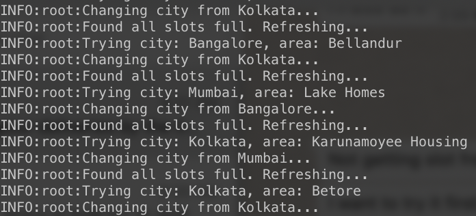

# bb-slotter
Get email alerts for delivery slots in BB :email: :dark_sunglasses:

Easily extensible to:

- support multiple email recipients
- support multiple cities and pin codes

For more details on hosting the app, read [here](DEPLOY.md).

## `bb-slotter` in action

Docker container running in AWS EC2 instance:



## Email alert example


## Building image

These environment variables must be present while building the (executable) docker image using `make build`.

```bash
FROM_ADDR=...
EMAIL_PASSWORD=...
URL=https://www.bigbasket.com/pd/241600/tata-salt--iodized-1-kg-pouch/
```

Also, before building image, `subscribers.json` file is required.

Example:

```json
[
  {
    "city": "xyz1",
    "area": "xyz1",
    "email": "xyz1@abc.com"
  },
  {
    "city": "xyz2",
    "area": "xyz2",
    "email": "xyz2@abc.com"
  }
]
```

## Running the image

```bash
make run
```

## Disclaimer

For educational purposes. BigBasket T&C [here](https://www.bigbasket.com/terms-and-conditions/).